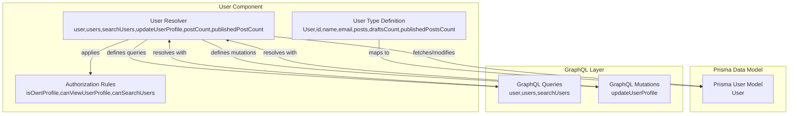
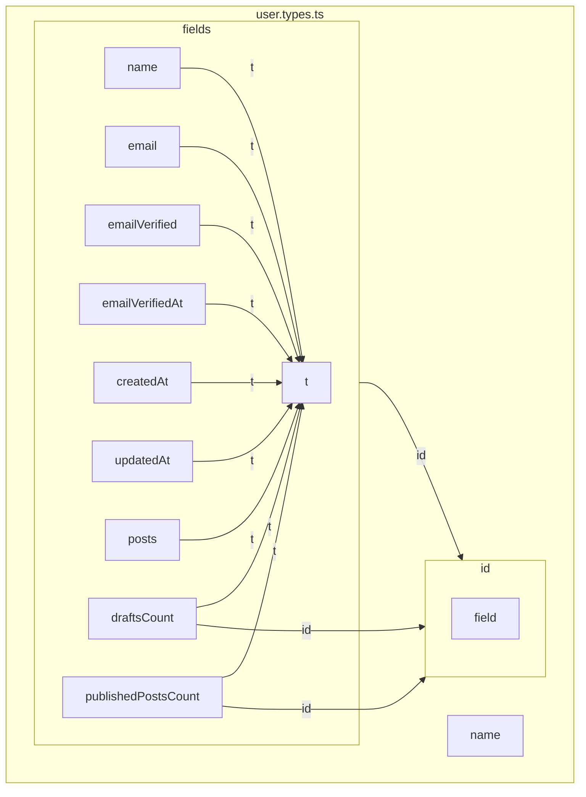
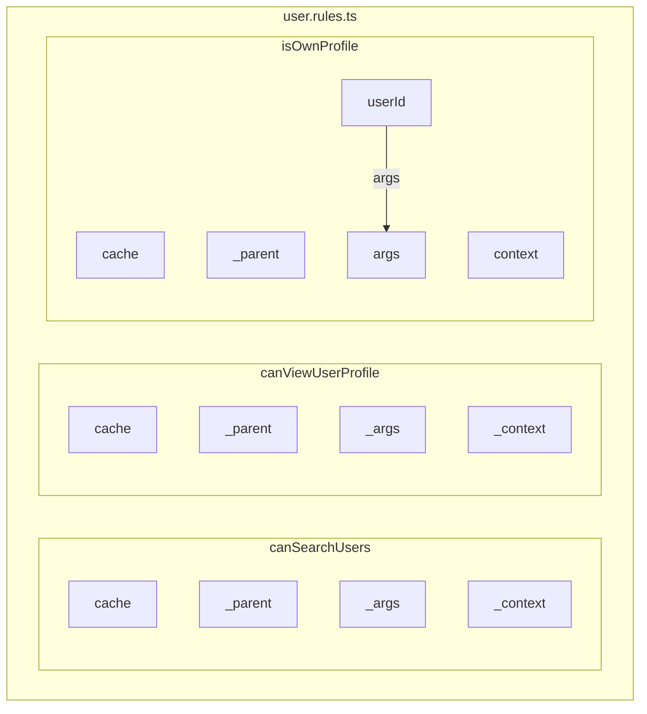

# Codebase Research Report

## Query
Investigate the "User" component in detail. Provide a comprehensive analysis of its architecture, responsibilities, and implementation details.

## Answer
### System Diagram

### Summary
# CodeViz User Component Analysis

## Overview

This report provides an analysis of the **User** component within the codebase. Due to token limitations, some aspects of the analysis are incomplete. The analysis focuses on the GraphQL type definition, resolver, and authorization rules.

## User Type Definition (src/modules/users/types/user.types.ts)

-   The `User` type (node:GraphQLUserType) represents a user in the system.
-   It leverages the Relay Node pattern for global identification and uses DataLoader for optimized data fetching.
-   It maps to the Prisma `User` model.
-   The `User` type has the following fields:
    -   `id`: A unique identifier for the user (maps to Prisma's numeric ID but exposed as a Relay global ID).
    -   `name`: The user's name (nullable string).
    -   `email`: The user's email address (string).
    -   `emailVerified`: A boolean indicating whether the email address has been verified.
    -   `emailVerifiedAt`: A timestamp indicating when the email was verified (nullable).
    -   `createdAt`: A timestamp indicating when the user was created.
    -   `updatedAt`: A timestamp indicating when the user was last updated.
    -   `posts`: A connection to the user's posts, with cursor-based pagination, total count, filtering by published status, and ordering by creation date.
    -   `draftsCount`: The number of unpublished posts by the user. Resolved using a direct query to the Prisma `Post` model. `(file:src/modules/users/types/user.types.ts:45)`
    -   `publishedPostsCount`: The number of published posts by the user. Resolved using a direct query to the Prisma `Post` model. `(file:src/modules/users/types/user.types.ts:54)`
-   Key Interactions:
    -   The `User` type is defined using `builder.prismaNode('User', ...)`, indicating integration with a Prisma data model.
    -   It uses `t.relatedConnection('posts', ...)` to define a connection to the user's posts, suggesting a relationship between the `User` and `Post` types.

### Mermaid Diagram of User Type

## User Resolver (src/modules/users/user.resolver.ts)

-   The `User` resolver is responsible for handling GraphQL operations related to retrieving and updating user data.
-   It interacts directly with the Prisma client to fetch and modify user information in the database.
-   It also handles authorization checks and input validation.
-   **Queries:**
    -   `user`: Retrieves a single user by ID.
        -   Arguments: `id` (required)
        -   Returns: A `User` object or `null` if not found.
        -   Authorization: `isPublic` or `isAuthenticatedUser` (line 34)
    -   `users`: Retrieves a list of users with optional filtering and pagination.
        -   Arguments: `where` (optional, `UserWhereInput`), `orderBy` (optional, `UserOrderByInput`)
        -   Returns: A connection of `User` objects.
        -   Authorization: `isPublic` (line 65)
    -   `searchUsers`: Searches users by name or email.
        -   Arguments: `search` (required, string)
        -   Returns: A connection of `User` objects.
        -   Authorization: `isPublic` (line 92)
-   **Mutations:**
    -   `updateUserProfile`: Updates the profile of the currently authenticated user.
        -   Arguments: `input` (required, `UpdateUserInput`) which contains `name` and `email` (both optional).
        -   Returns: The updated `User` object.
        -   Authorization: `isAuthenticatedUser` (line 178)
-   In addition, the resolver also defines fields on the `User` type:
    -   `postCount`: Returns the total number of posts by a user.
    -   `publishedPostCount`: Returns the number of published posts by a user.

### Mermaid Diagram of User Resolver

```mermaid
%% Summary diagram for /Users/aleksandrsemenov/Projects/graphql-auth/src/modules/users/user.resolver.ts
graph TD

    subgraph 676["user.resolver.ts"]
        686["cursor"]
        694["cursor"]
        680["description"]
        687["description"]
        695["description"]
        701["description"]
        704["description"]
        709["description"]
        679["nullable"]
        681["shield"]
        688["shield"]
        696["shield"]
        710["shield"]
        677["t"]
        684["t"]
        692["t"]
        700["t"]
        703["t"]
        707["t"]
        678["type"]
        685["type"]
        693["type"]
        708["type"]
        subgraph 706["UpdateUserInput"]
            752["fields"]
        end
        subgraph 682["args"]
            713["id"]
        end
        subgraph 689["args"]
            721["orderBy"]
            720["where"]
        end
        subgraph 697["args"]
            733["search"]
        end
        subgraph 711["args"]
            753["input"]
        end
        subgraph 683["resolve"]
            717["_context"]
            715["_parent"]
            716["args"]
            714["query"]
            719["user"]
            718["userId"]
            %% Edges at this level (grouped by source)
            719["user"] -->|query| 714["query"]
            719["user"] -->|userId| 718["userId"]
            718["userId"] -->|args| 716["args"]
        end
        subgraph 690["resolve"]
            725["_context"]
            723["_parent"]
            724["args"]
            727["orderBy"]
            722["query"]
            726["where"]
            %% Edges at this level (grouped by source)
            726["where"] -->|args| 724["args"]
            727["orderBy"] -->|args| 724["args"]
        end
        subgraph 698["resolve"]
            737["_context"]
            735["_parent"]
            736["args"]
            739["orderBy"]
            734["query"]
            738["where"]
            %% Edges at this level (grouped by source)
            738["where"] -->|args| 736["args"]
        end
        subgraph 702["resolve"]
            745["_args"]
            746["_context"]
            744["user"]
            747["where"]
            %% Edges at this level (grouped by source)
            747["where"] -->|user| 744["user"]
        end
        subgraph 705["resolve"]
            749["_args"]
            750["_context"]
            748["user"]
            751["where"]
            %% Edges at this level (grouped by source)
            751["where"] -->|user| 748["user"]
        end
        subgraph 712["resolve"]
            755["_parent"]
            756["args"]
            757["context"]
            760["existingUser"]
            754["query"]
            759["updateData"]
            761["user"]
            758["userId"]
            %% Edges at this level (grouped by source)
            761["user"] -->|query| 754["query"]
            761["user"] -->|userId| 758["userId"]
            761["user"] -->|updateData| 759["updateData"]
            758["userId"] -->|context| 757["context"]
            760["existingUser"] -->|user| 761["user"]
            760["existingUser"] -->|args| 756["args"]
        end
        subgraph 691["totalCount"]
            730["_context"]
            728["_parent"]
            729["args"]
            732["where"]
            731["whereClause"]
            %% Edges at this level (grouped by source)
            732["where"] -->|whereClause| 731["whereClause"]
            731["whereClause"] -->|where| 732["where"]
        end
        subgraph 699["totalCount"]
            742["_context"]
            740["_parent"]
            741["args"]
            743["where"]
        end
        %% Edges at this level (grouped by source)
        713["id"] -->|t| 677["t"]
        720["where"] -->|t| 684["t"]
        721["orderBy"] -->|t| 684["t"]
        733["search"] -->|t| 692["t"]
        753["input"] -->|t| 707["t"]
        753["input"] -->|UpdateUserInput| 706["UpdateUserInput"]
        731["whereClause"] -->|args| 724["args"]
        731["whereClause"] -->|args| 690["resolve"]
        743["where"] -->|args| 736["args"]
        743["where"] -->|args| 698["resolve"]
        691["totalCount"] -->|args| 724["args"]
        691["totalCount"] -->|args| 690["resolve"]
        699["totalCount"] -->|args| 736["args"]
        699["totalCount"] -->|args| 698["resolve"]
        682["args"] -->|t| 677["t"]
        689["args"] -->|t| 684["t"]
        697["args"] -->|t| 692["t"]
        711["args"] -->|UpdateUserInput| 706["UpdateUserInput"]
        711["args"] -->|t| 707["t"]
    end
```

## User Authorization Rules (src/modules/users/user.rules.ts)

-   **`isOwnProfile`** (file:src/modules/users/user.rules.ts:15) (node:isOwnProfile_789):
    -   Ensures users can only modify their own profile.
    -   It checks if the `id` argument (representing the user ID to be modified) matches the ID of the currently logged-in user (`context.user.id`).
    -   If the IDs don't match, it throws an `AuthorizationError`.
-   **`canViewUserProfile`** (file:src/modules/users/user.rules.ts:41) (node:canViewUserProfile_456):
    -   Determines if a user profile can be viewed.
    -   Currently, all profiles are considered public and viewable by all users. The code comments indicate that in a real application, this rule might check profile privacy settings.
-   **`canSearchUsers`** (file:src/modules/users/user.rules.ts:53) (node:canSearchUsers_123):
    -   Determines if users can search for other users.
    -   Currently, all users are allowed to search. The code comments suggest that in a production environment, this might be restricted to authenticated users.

### Mermaid Diagram of User Rules

## Missing Information

Due to token limitations, the following information could not be retrieved:

-   How the User component interacts with the authentication module (login, registration).
-   Database tables/models associated with the User component.
-   Any background jobs or scheduled tasks related to the User component.
-   A summary of the key files related to the User component.

## Walkthrough Steps

### 1. User Component Overview
The `User` component is defined using a GraphQL type, a resolver, and authorization rules. The `User` type definition specifies the structure of user data, the resolver handles queries and mutations related to users, and the authorization rules define access control policies.

### 2. User Type Definition Details
The `User` type definition leverages the Relay Node pattern for global identification and uses DataLoader for optimized data fetching. It maps to the Prisma `User` model and defines fields such as `id`, `name`, `email`, `emailVerified`, `emailVerifiedAt`, `createdAt`, `updatedAt`, `posts`, `draftsCount`, and `publishedPostsCount`. The `User` type interacts with the Prisma data model using `builder.prismaNode('User', ...)` and defines a connection to the user's posts using `t.relatedConnection('posts', ...)`.

### 3. User Resolver Functionality
The `User` resolver handles GraphQL operations related to retrieving and updating user data. It interacts with the Prisma client to fetch and modify user information in the database and handles authorization checks and input validation. The resolver defines queries such as `user`, `users`, and `searchUsers`, and mutations such as `updateUserProfile`. It also defines fields on the `User` type, such as `postCount` and `publishedPostCount`.

### 4. User Resolver Queries
The `user` query retrieves a single user by ID, requiring an `id` argument and returning a `User` object or `null` if not found. It is authorized by `isPublic` or `isAuthenticatedUser`. The `users` query retrieves a list of users with optional filtering and pagination, accepting `where` and `orderBy` arguments and returning a connection of `User` objects. It is authorized by `isPublic`. The `searchUsers` query searches users by name or email, requiring a `search` argument and returning a connection of `User` objects. It is authorized by `isPublic`.

### 5. User Resolver Mutations
The `updateUserProfile` mutation updates the profile of the currently authenticated user, requiring an `input` argument of type `UpdateUserInput` containing optional `name` and `email` fields. It returns the updated `User` object and is authorized by `isAuthenticatedUser`.

### 6. User Authorization Rules
The `isOwnProfile` authorization rule ensures users can only modify their own profile. It checks if the `id` argument matches the ID of the currently logged-in user (`context.user.id`) and throws an `AuthorizationError` if they don't match. The `canViewUserProfile` rule determines if a user profile can be viewed. Currently, all profiles are considered public. The `canSearchUsers` rule determines if users can search for other users. Currently, all users are allowed to search.

## Detailed Sub-Search Results

### 1. Describe the structure and purpose of the User type defined in src/modules/users/types/user.types.ts. (LoA: mid)
Okay, I have read the file. Here's a summary of the `User` type:

*   **Purpose:** The code defines a GraphQL object type `User` that represents a user in the system. It leverages the Relay Node pattern for global identification and uses DataLoader for optimized data fetching. It maps to the Prisma `User` model. (node:GraphQLUserType)
*   **Structure:** The `User` type has the following fields:
    *   `id`: A unique identifier for the user (maps to Prisma's numeric ID but exposed as a Relay global ID).
    *   `name`: The user's name (nullable string).
    *   `email`: The user's email address (string).
    *   `emailVerified`: A boolean indicating whether the email address has been verified.
    *   `emailVerifiedAt`: A timestamp indicating when the email was verified (nullable).
    *   `createdAt`: A timestamp indicating when the user was created.
    *   `updatedAt`: A timestamp indicating when the user was last updated.
    *   `posts`: A connection to the user's posts, with cursor-based pagination, total count, filtering by published status, and ordering by creation date.
    *   `draftsCount`: The number of unpublished posts by the user. Resolved using a direct query to the Prisma `Post` model.
    *   `publishedPostsCount`: The number of published posts by the user. Resolved using a direct query to the Prisma `Post` model.
*   **Key Interactions:**
    *   The `User` type is defined using `builder.prismaNode('User', ...)`, indicating integration with a Prisma data model.
    *   It uses `t.relatedConnection('posts', ...)` to define a connection to the user's posts, suggesting a relationship between the `User` and `Post` types.
    *   It directly queries the Prisma `Post` model within the `draftsCount` and `publishedPostsCount` resolvers. `(file:src/modules/users/types/user.types.ts:45)` and `(file:src/modules/users/types/user.types.ts:54)`
*   **File:** `src/modules/users/types/user.types.ts`

### 2. Explain the responsibilities of the User resolver in src/modules/users/user.resolver.ts. What GraphQL queries and mutations does it handle related to users? (LoA: mid)
Based on the file content, here's a summary of the `User` resolver's responsibilities and the GraphQL queries/mutations it handles:

- **Responsibilities:** The `User` resolver is responsible for handling GraphQL operations related to retrieving and updating user data. It interacts directly with the Prisma client to fetch and modify user information in the database. It also handles authorization checks and input validation.

- **Queries:**
    - `user`: Retrieves a single user by ID.
        - Arguments: `id` (required)
        - Returns: A `User` object or `null` if not found.
        - Authorization: `isPublic` or `isAuthenticatedUser` (line 34)
    - `users`: Retrieves a list of users with optional filtering and pagination.
        - Arguments: `where` (optional, `UserWhereInput`), `orderBy` (optional, `UserOrderByInput`)
        - Returns: A connection of `User` objects.
        - Authorization: `isPublic` (line 65)
    - `searchUsers`: Searches users by name or email.
        - Arguments: `search` (required, string)
        - Returns: A connection of `User` objects.
        - Authorization: `isPublic` (line 92)

- **Mutations:**
    - `updateUserProfile`: Updates the profile of the currently authenticated user.
        - Arguments: `input` (required, `UpdateUserInput`) which contains `name` and `email` (both optional).
        - Returns: The updated `User` object.
        - Authorization: `isAuthenticatedUser` (line 178)

In addition, the resolver also defines fields on the `User` type:
    - `postCount`: Returns the total number of posts by a user.
    - `publishedPostCount`: Returns the number of published posts by a user.

### 3. What authorization rules are defined for the User component in src/modules/users/user.rules.ts? (LoA: mid)
Here are the authorization rules defined in `src/modules/users/user.rules.ts`:

*   **`isOwnProfile`** (file:src/modules/users/user.rules.ts:15) (node:isOwnProfile_789):
    *   Ensures users can only modify their own profile.
    *   It checks if the `id` argument (representing the user ID to be modified) matches the ID of the currently logged-in user (`context.user.id`).
    *   If the IDs don't match, it throws an `AuthorizationError`.
*   **`canViewUserProfile`** (file:src/modules/users/user.rules.ts:41) (node:canViewUserProfile_456):
    *   Determines if a user profile can be viewed.
    *   Currently, all profiles are considered public and viewable by all users. The code comments indicate that in a real application, this rule might check profile privacy settings.
*   **`canSearchUsers`** (file:src/modules/users/user.rules.ts:53) (node:canSearchUsers_123):
    *   Determines if users can search for other users.
    *   Currently, all users are allowed to search. The code comments suggest that in a production environment, this might be restricted to authenticated users.

### 4. How does the User component interact with the authentication module, specifically regarding login and registration? (LoA: mid)
Token limit reached for this sub-search.

### 5. What database tables or models are associated with the User component? (LoA: mid)
Token limit reached for this sub-search.

### 6. Are there any background jobs or scheduled tasks associated with the User component? (LoA: mid)
Token limit reached for this sub-search.

### 7. Summarize the key files related to the User component: src/modules/users/types/user.types.ts, src/modules/users/user.resolver.ts, and src/modules/users/user.rules.ts (LoA: high)
Token limit reached for this sub-search.

---
*Generated by [CodeViz.ai](https://codeviz.ai) on 22/06/2025, 00:26:53*
