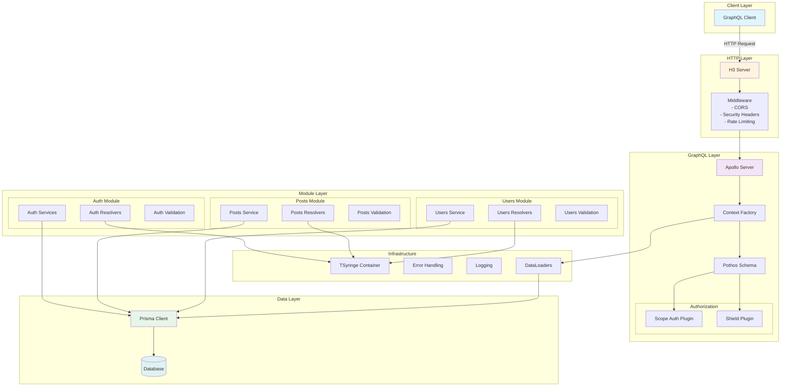
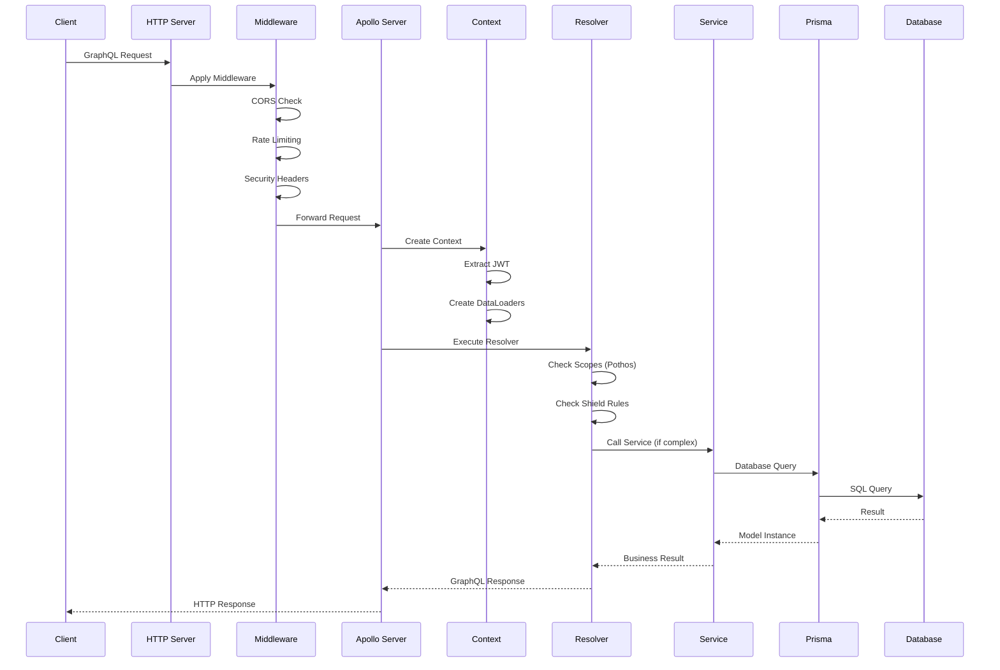
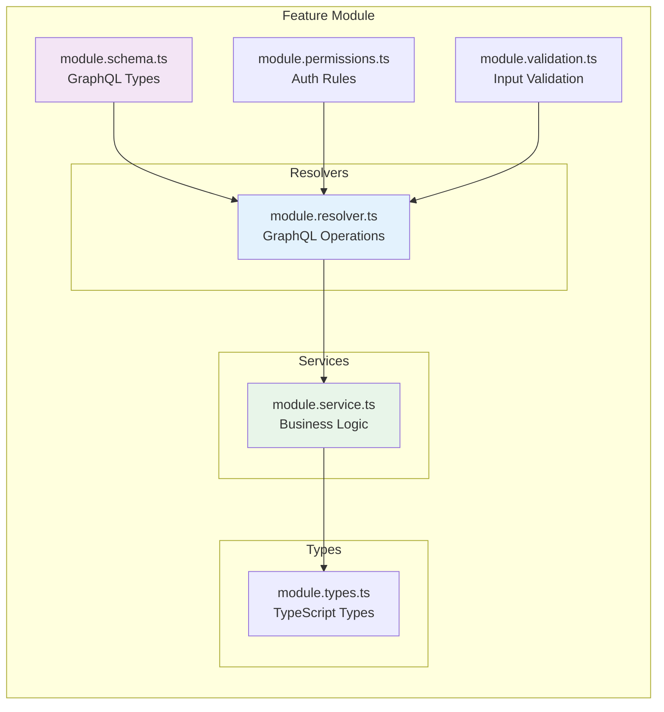
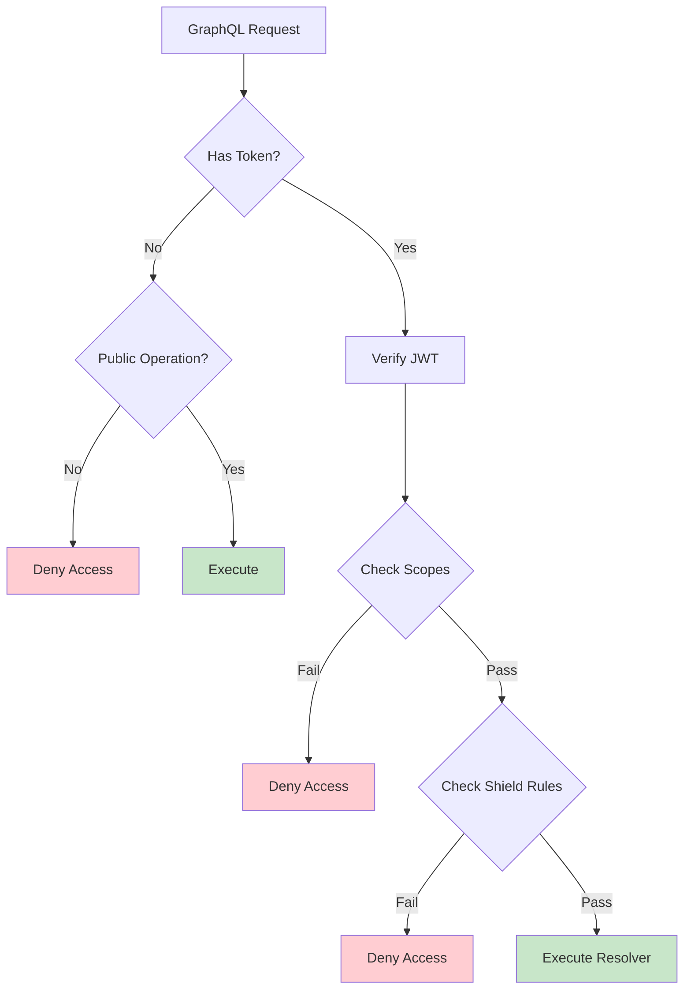
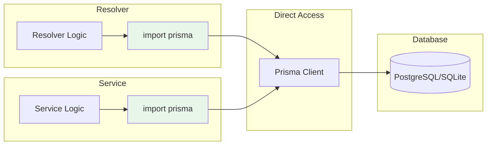
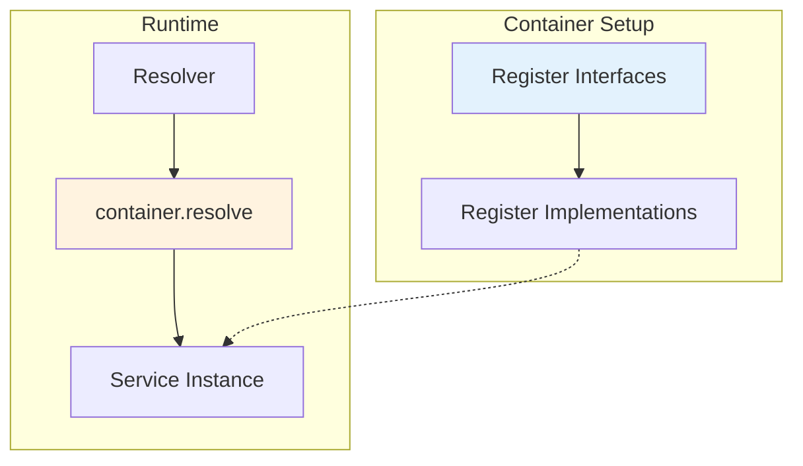
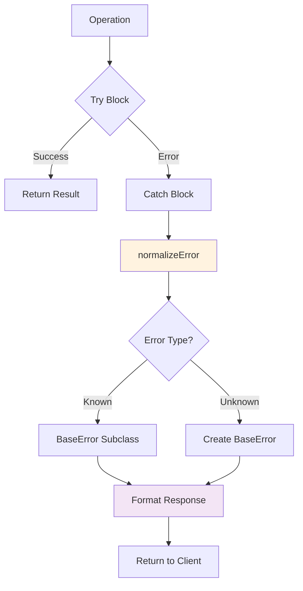

# Architecture Diagrams

## System Architecture Overview

## Request Flow Diagram

## Module Structure

## Authorization Flow

## Data Access Pattern

## Dependency Injection

## Error Handling Flow

These diagrams illustrate the key architectural patterns and data flows in the GraphQL authentication service.